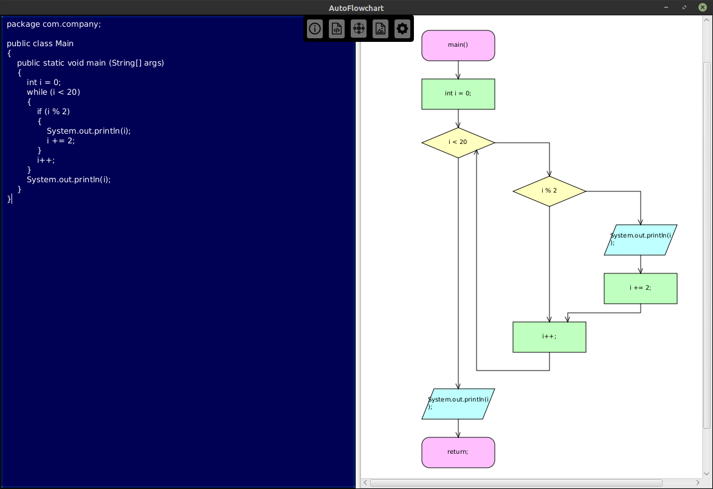

# AutoFlowchart

AutoFlowchart is a simple JavaFX program that allows you to automatically generate a flowchart out of your Java code.

## **Warning!*/

This program is no longer maintained. It was developed as a university project, and since we (project team) weren't so experienced with Java, we chose not the best tools for implementing this idea, and made some wrong decisions that make further developing of the program without rewriting from scratch way too hard. However, the latest version of app should work (not without the bugs, unfortunately, but they are quite small), so you can try to build it. Hope the program can still help someone who wants to make something similar, and sorry if it dissapointed you! 

## Usage
The program is really simple: all you need to do in order to generate a flowchart is to paste your code to the left pane or import from file, and then click on little button placed exactly in the top center of the window. After that, you'll see your generated flowchart in the right pane, and you can scroll to view it in full. You can also add some changes to code and generate it again, or if you are satisfied, you can export it to .png file using the second from right button.

## Supported features
* Simple sequential code
* Branching operators (if/else if/else)
* Cycles (for, while and foreach)
* Jump operators (break and continue)

## Future plans
Unfortunately, right now AutoFlowchart can generate code only for Java. So the main task of the closest new version will be to add support for other languages, for example C++ and Python. Another one very useful feature that we are planning to implement is export to .svg image format, because it will allow user to easily edit flowcharts after generation. When these features will be implemented, we will focus on fixing existing bugs and improving user experience. Finally, if you have an idea of the feature that can make AutoFlowchart better - you can always add an issue with tag "Feature suggestion", and if it's good, we will try to implement it as soon as possible.

## Contributing
If you want to contribute to the project, you are always welcome. Fork the project, and then make a pull request, and if everything's okay with it we will be happy to merge it. But for major changes, please open an issue first to discuss what you would like to change. Also, please make sure to update tests as appropriate.

## License
[MIT](LICENSE.md)
